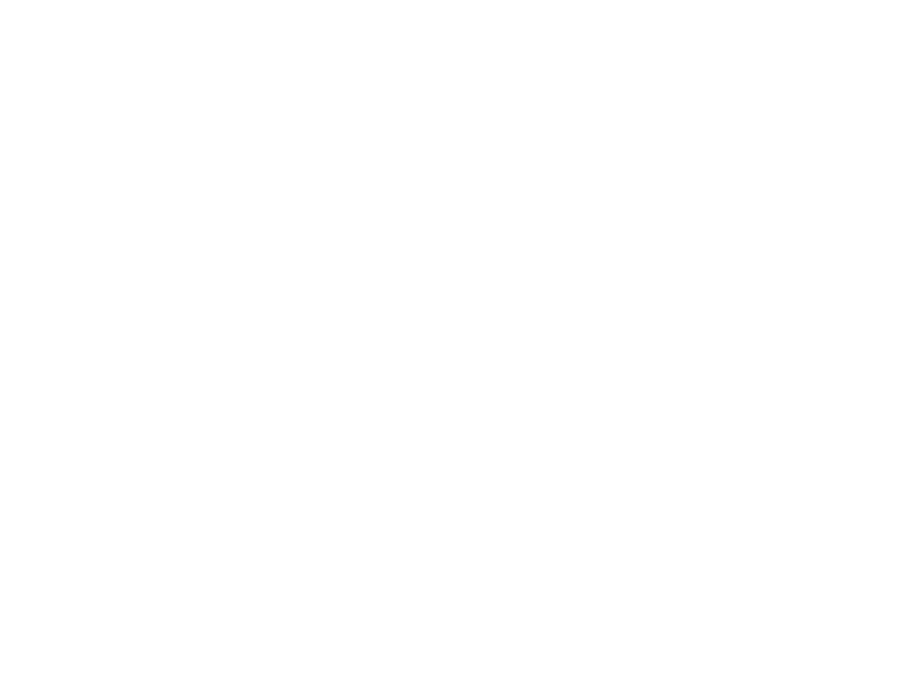
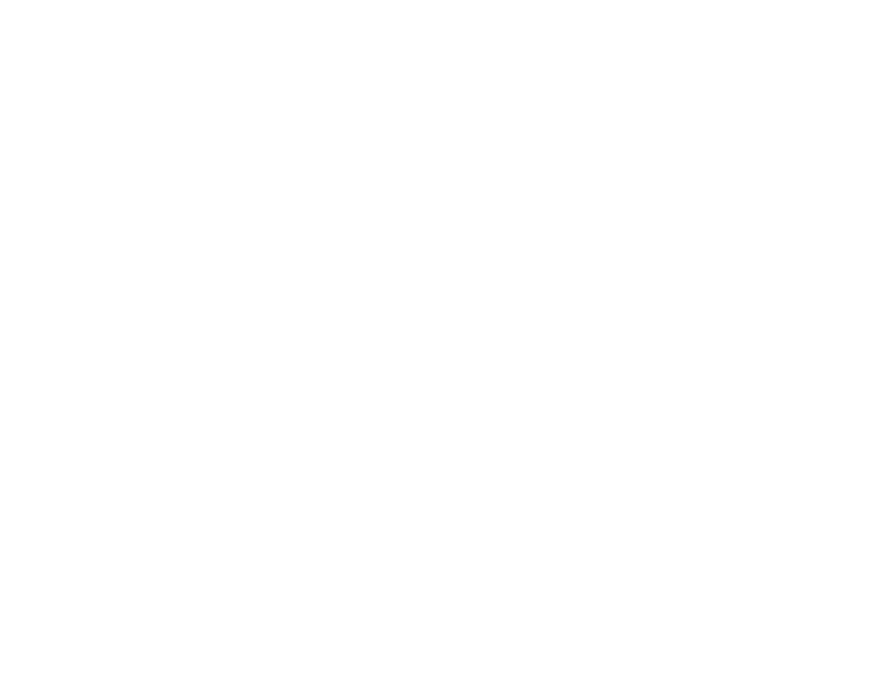

# 트래픽 부하 기반 Baseline 실험 보고서

## 1. 실험 목적

본 실험의 목적은 시나리오 기반 트래픽을 서버에 적용하여, 고정된 자원 환경에서 시스템의 성능 변화를 관찰하는 것이다.  
특히 트래픽 증가에 따른 요청 처리 성공률과 응답 지연 시간을 분석함으로써, 동적 자원 할당 기법의 필요성을 검증하는 것을 목표로 한다.

---

## 2. 실험 환경

- 트래픽 입력: 시나리오 기반 CSV 데이터 (1초 단위 RPS)
- 부하 생성기: Python 기반 load generator (aiohttp)
- 서버: FastAPI 기반 테스트 서버
- 자원 상태: CPU 고정 (Baseline)
- 측정 지표:
  - 요청 처리 성공 수 (success_count)
  - 요청 처리 실패 수 (fail_count)
  - 평균 응답 시간 (avg_latency_ms)
  - p95 응답 시간 (p95_latency_ms)

---

## 3. 실험 방법

1. 시나리오 기반 트래픽 데이터를 CSV 형태로 정의한다.
2. load generator를 통해 시간별 target_rps에 따라 서버에 요청을 발생시킨다.
3. 각 요청에 대해 성공 여부 및 응답 시간을 기록한다.
4. 결과를 기반으로 시간에 따른 성능 변화를 분석한다.

---

## 4. 결과 분석

### 4.1 RPS 대비 요청 처리 결과

- 초기 구간에서는 success_count가 target_rps와 거의 동일하게 유지되며 실패 요청이 발생하지 않는다.
- 트래픽이 증가함에 따라 success_count는 증가하지만 일정 수준 이후 포화 상태에 도달한다.
- 이후 추가 요청은 fail_count 증가로 나타난다.

#### 해석

서버의 처리 한계를 초과하는 시점이 존재하며, 자원이 고정된 상태에서는 트래픽 증가에 대응하지 못함을 의미한다.

---

### 4.2 Latency 변화 분석

- 트래픽이 낮은 구간에서는 avg_latency와 p95_latency가 낮게 유지된다.
- 트래픽 증가에 따라 두 지표 모두 증가한다.
- 특히 peak 구간에서 p95 latency가 급격히 증가한다.

#### 해석

p95 latency 증가는 일부 요청이 매우 느려지는 현상을 의미하며, 이는 시스템 과부하 상태를 나타낸다.

---

## 5. 종합 분석

1. 서버는 일정 수준 이상의 트래픽에서 처리 한계에 도달한다.
2. 처리 한계를 초과하면 요청 실패가 발생한다.
3. 과부하 상태에서는 응답 지연이 크게 증가한다.
4. p95 latency는 성능 저하를 민감하게 반영한다.

---

## 6. 결론

본 실험은 고정된 자원 환경에서 트래픽 증가에 따른 성능 저하를 확인한 baseline 실험이다.  
이를 통해 동적 자원 할당 방식(reactive 또는 predictive)의 필요성을 확인할 수 있다.

---

## 7. 한 줄 요약

트래픽 증가 시 서버는 처리 한계에 도달하며, 이후 요청 실패와 응답 지연이 발생한다.
