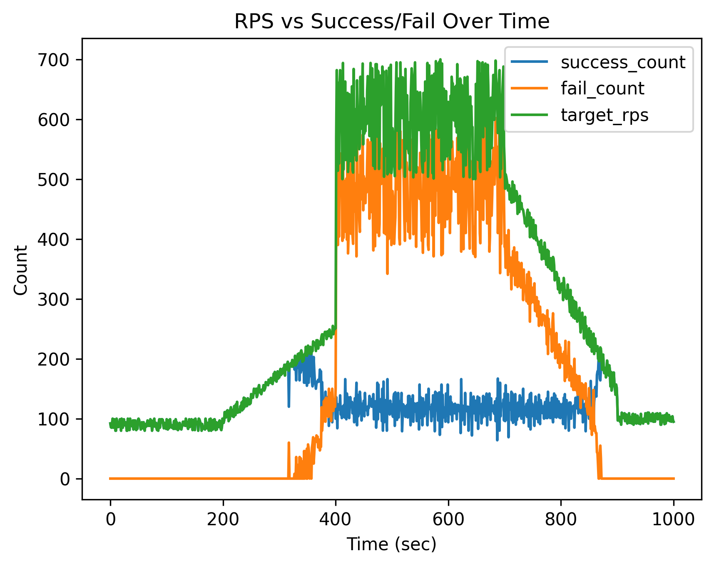
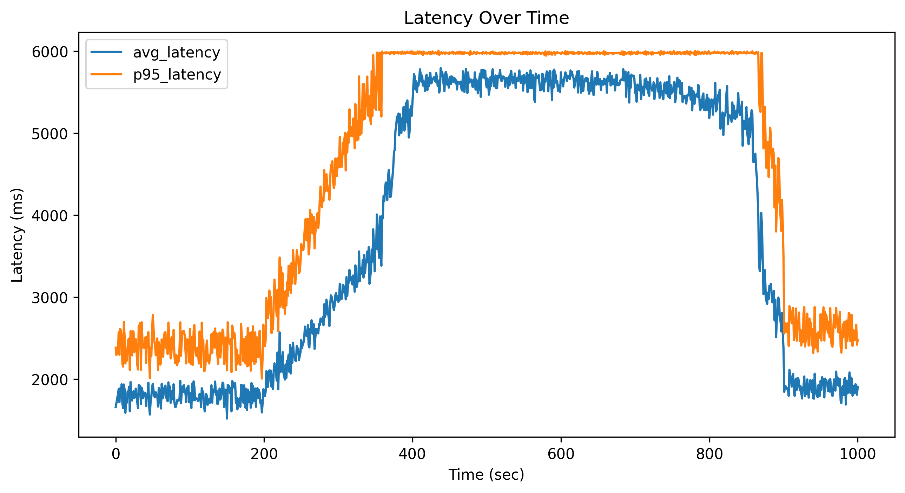
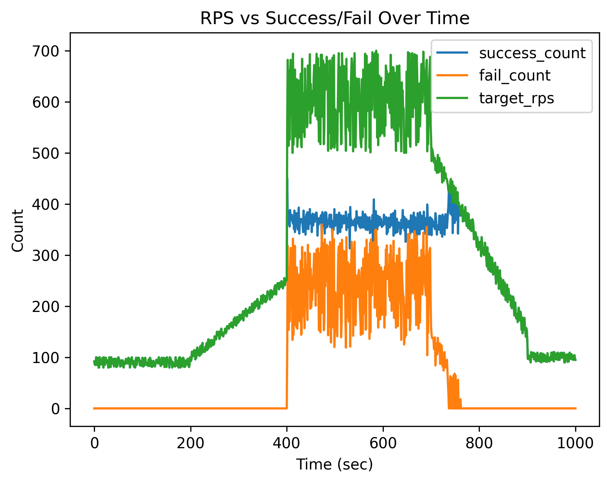
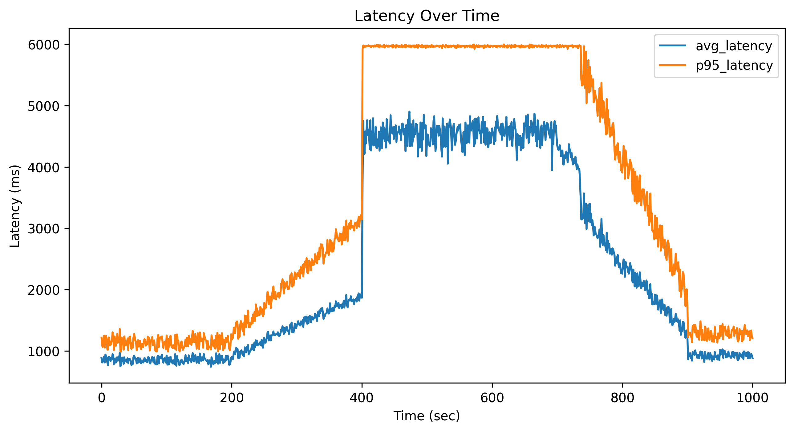
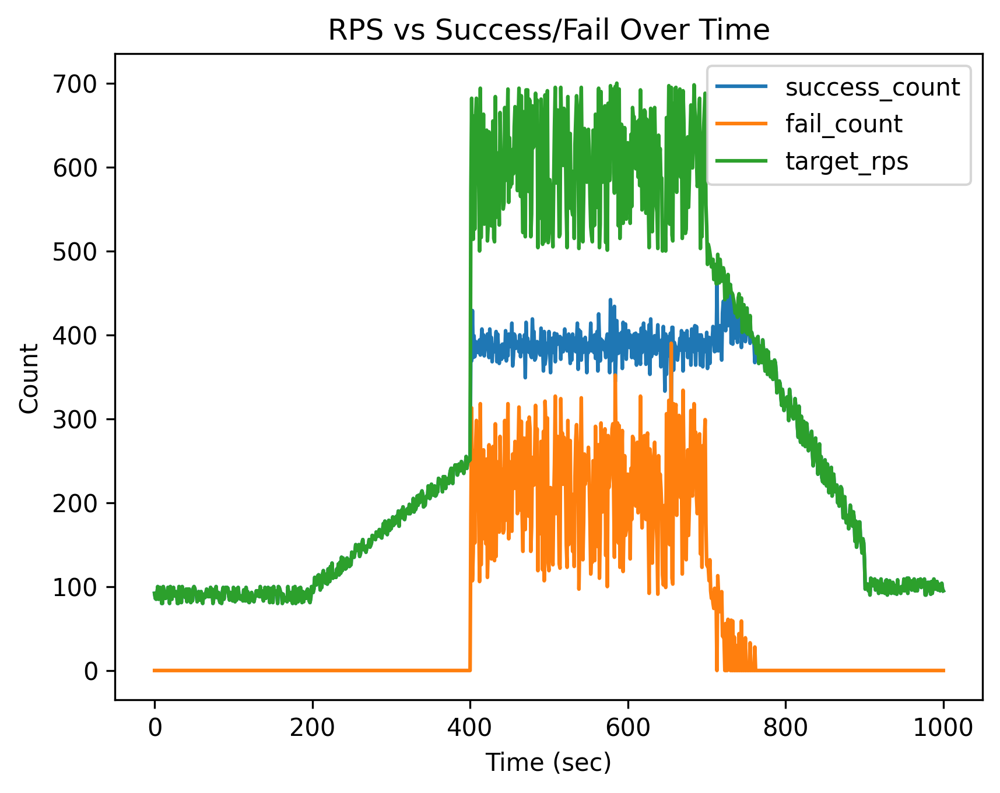
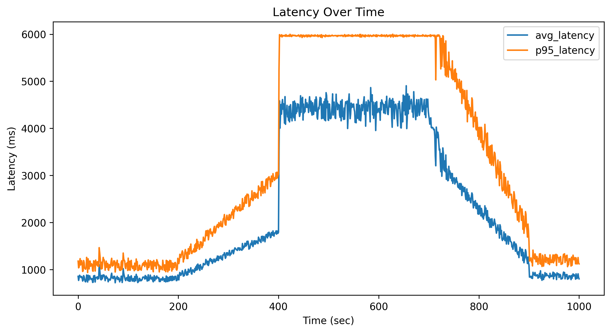

# Baseline Fixed CPU Resource Experiment Analysis

## 1. 실험 목적

본 실험은 고정된 CPU 자원 환경에서 시스템의 성능 한계를 분석하기 위해 수행되었다.  
동일한 트래픽 패턴을 입력하면서 CPU 자원을 제한하여 처리량, 실패율, 지연시간 변화를 관찰한다.

---

## 2. 실험 환경

- Application: baseline server
- Load Pattern: `sale_event_traffic.csv`
- CPU 제한:
  - 0.5
  - 1.0
  - 1.5

---

## 3. 결과 분석

---

### 3.1 CPU 0.5

#### Success / Fail

- 약 400 RPS 이후부터 실패 급증
- 성공 처리량은 약 100~140 수준에서 포화
- 시스템이 빠르게 한계 도달

#### Latency

- 평균 latency 약 5500ms
- P95 latency 6000ms 근접
- 심각한 큐잉 발생

#### 해석

- CPU 부족으로 인한 명확한 병목
- 처리 가능한 최대 RPS ≈ 120

---

### 3.2 CPU 1.0

#### Success / Fail

- 성공 처리량 약 350~380 수준
- 실패 감소했지만 여전히 존재
- 중간 구간에서 부분적인 과부하

#### Latency

- 평균 latency 약 4500ms
- P95 latency 여전히 높음

#### 해석

- CPU 증가로 성능 약 3배 개선
- 하지만 saturation 여전히 존재

---

### 3.3 CPU 1.5

#### Success / Fail

- 성공 처리량 약 380~420
- 실패율 추가 감소
- 가장 안정적인 상태

#### Latency

- 평균 latency 약 4300ms
- P95 latency 일부 개선

#### 해석

- 성능 향상은 있지만 증가폭 감소
- CPU 외 병목 존재 가능성

---

## 4. 핵심 인사이트

### 4.1 CPU vs 처리량

| CPU | Max Success |
|-----|------------|
| 0.5 | ~120 RPS |
| 1.0 | ~370 RPS |
| 1.5 | ~400 RPS |

- CPU 증가 → 처리량 증가
- 하지만 1.0 이후부터 증가폭 감소

---

### 4.2 실패 패턴

- CPU 낮을수록:
  - 실패 빠르게 발생
  - 실패 비율 높음

- CPU 높을수록:
  - 더 오래 버팀
  - 실패 늦게 발생

---

### 4.3 Latency 특징

- 부하 증가 시 latency 급증
- P95는 항상 높은 상태 유지
- 요청이 큐에 쌓이는 구조

---

## 5. 결론

- CPU는 성능에 직접적인 영향을 준다
- 하지만 고정 자원 환경에서는 한계 존재
- 트래픽 증가 시:
  - 실패 증가
  - latency 증가
  - 서비스 품질 저하

---

## 6. Reactive 필요성

본 실험 결과는 다음을 보여준다:

> 고정된 자원으로는 변동 트래픽을 처리할 수 없다

따라서 필요:

- Auto Scaling
- Backpressure
- Reactive Architecture

---

## 7. 다음 단계

- Reactive 서버 구현
- 동일 조건 비교 실험

---

## 한 줄 요약

> CPU를 늘리면 성능은 증가하지만, 고정 자원 구조에서는 결국 한계가 존재한다.