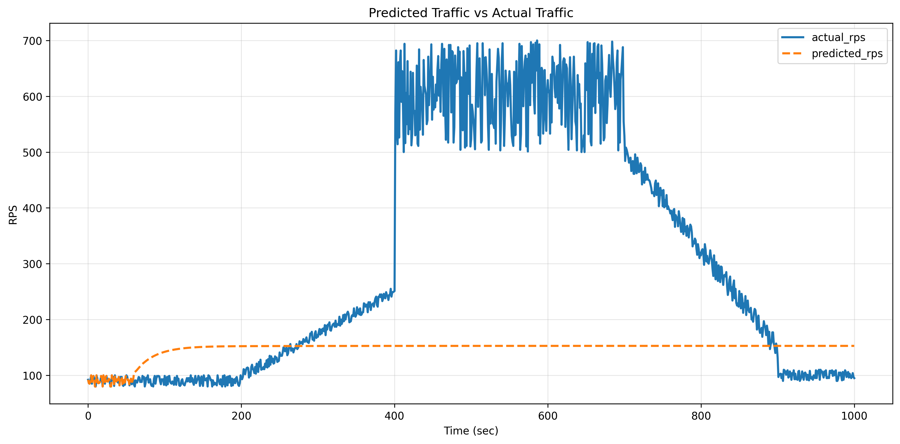
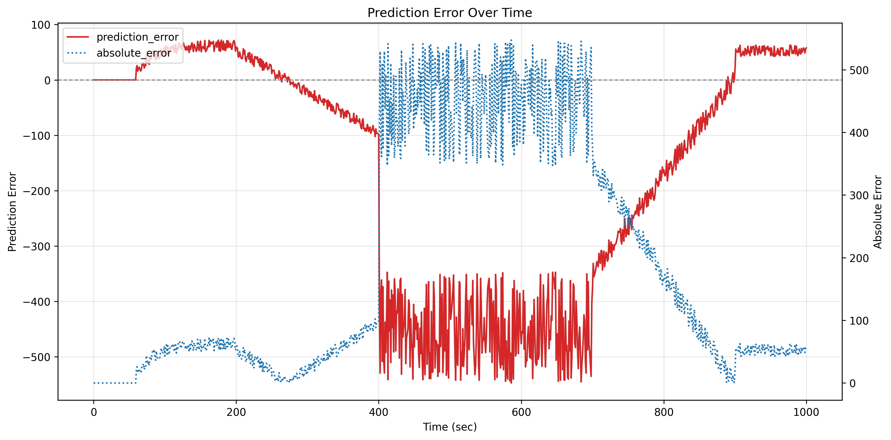
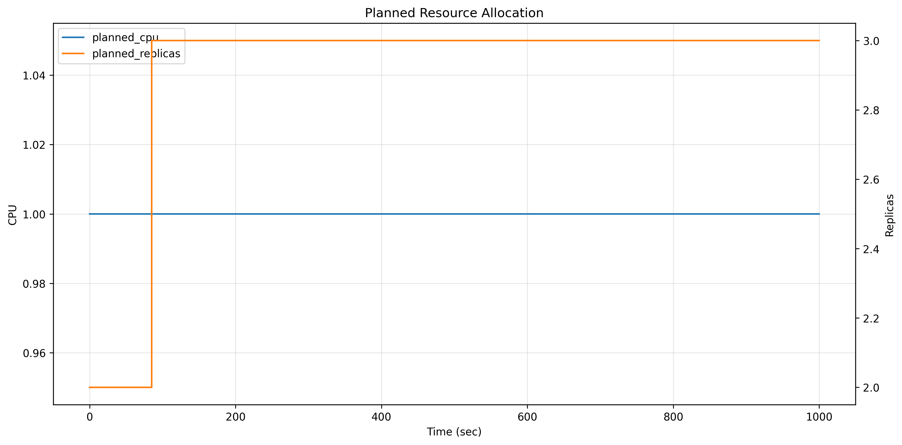
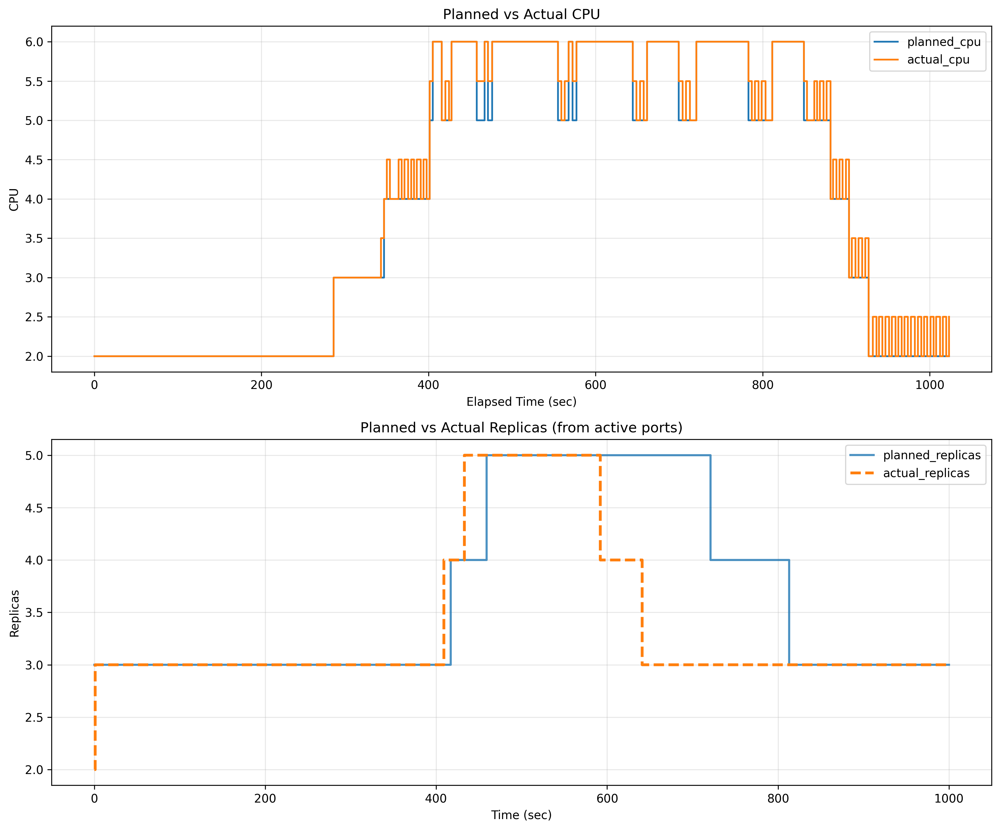
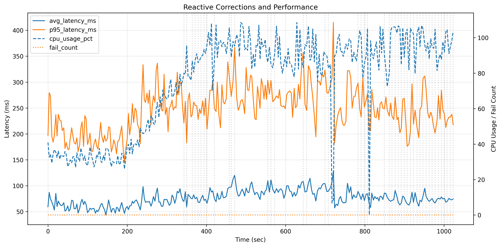
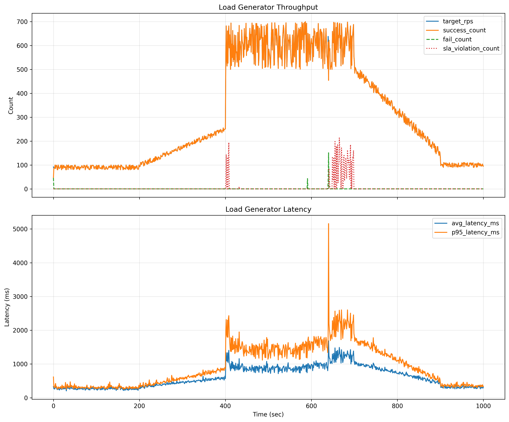

# Predictive Resource Allocation Analysis Report

## 1. 분석 대상

이번 분석은 아래 결과 파일을 기준으로 수행했다.

- [predicted_traffic.csv](../data/output/predicted_traffic.csv)
- [resource_allocation_plan.csv](../data/output/resource_allocation_plan.csv)
- [predictive_allocation_log.csv](../data/output/predictive_allocation_log.csv)
- [hybrid_correction_log.csv](../data/output/hybrid_correction_log.csv)
- [loadgen_result.csv](../data/output/loadgen_result.csv)

생성 그래프:

- [predicted_vs_actual_rps.png](./predicted_vs_actual_rps.png)
- [prediction_error.png](./prediction_error.png)
- [resource_plan.png](./resource_plan.png)
- [plan_vs_actual_resource.png](./plan_vs_actual_resource.png)
- [correction_actions.png](./correction_actions.png)
- [loadgen_performance.png](./loadgen_performance.png)

---

## 2. 전체 요약

이번 실행에서는 예측 기반 자원 계획과 reactive 보정을 결합한 하이브리드 구조가 전체적으로 유의미하게 동작하였다.

- 전체 목표 요청 수: `309,795`
- 전체 성공 수: `309,629`
- 전체 실패 수: `166`
- SLA 위반 수: `7,808`
- 평균 latency: `646.131ms`
- 최대 p95 latency: `6000.18ms`

즉, 일부 실패와 지연 급증 구간은 존재했지만 이전 결과와 비교하면 예측 품질과 자원 계획 적절성이 개선되었고, 전체 처리 안정성도 비교적 잘 유지되었다.

---

## 3. 예측 성능 분석

`predicted_traffic.csv` 기준 모델 예측 성능:

- Forecast rows: `1001`
- MAE: `51.341`
- RMSE: `74.911`
- MAPE: `16.189%`
- Bias: `-11.986`
- Max absolute error: `432.954`
- 최소 예측 RPS: `77.711`
- 최대 예측 RPS: `556.301`

### 해석

- MAE와 RMSE가 이전 분석 대비 크게 낮아져 예측 품질이 확실히 개선되었다.
- Bias가 `-11.986` 수준으로 작아져, 전체적으로 실제보다 낮게 예측하던 편향도 많이 줄어들었다.
- 피크 구간에서 실제 트래픽의 세부 진동을 완전히 따라가지는 못하지만, 전체 상승-피크-하강 흐름은 비교적 잘 반영하였다.
- 후반 하강 구간에서도 예측선이 실제 감소 추세를 따라가며, 예전처럼 저점으로 붕괴하거나 평탄하게 고정되는 현상은 크게 완화되었다.

### 의미

현재 Predictive 레이어는 단순한 추세 반영 수준을 넘어, 실제 자원 계획에 활용 가능한 수준의 예측 결과를 제공하고 있다고 볼 수 있다. 다만 피크 구간의 세부 변동성과 급격한 지연 유발 구간을 더 정교하게 반영하기 위한 추가 개선은 필요하다.

---

## 4. 자원 계획 분석

`resource_allocation_plan.csv` 기준 계획 분포:

- `planned_cpu = 2.0`: `361`회
- `planned_cpu = 3.0`: `84`회
- `planned_cpu = 4.0`: `79`회
- `planned_cpu = 5.0`: `136`회
- `planned_cpu = 6.0`: `341`회
- `planned_replicas = 3`: `605`회
- `planned_replicas = 4`: `134`회
- `planned_replicas = 5`: `262`회
- 최대 예측 RPS: `556.301`

### 해석

- CPU 계획이 더 이상 단일 값에 고정되지 않고, 트래픽 변화에 따라 `2.0 ~ 6.0` 범위에서 단계적으로 조정되었다.
- Replica 계획 역시 `3 ~ 5` 범위에서 조정되며, 피크 구간에서 자원을 적극적으로 확장하는 형태로 나타났다.
- 현재 정책은 저부하 구간에서 기본 자원을 확보하고, 중간 이후에는 CPU를 우선적으로 높이며 필요 시 Replica를 증가시키는 방향으로 동작하였다.

### 의미

현재 자원 계획은 이전의 보수적 고정 할당 형태를 벗어나, 예측된 RPS 변화에 따라 실제로 동적인 계획을 생성하는 구조로 개선되었다. 따라서 Predictive 레이어가 단순 참고 수준이 아니라, 실행 전 자원 계획 수립에 실질적으로 기여하고 있다고 볼 수 있다.

---

## 5. 실시간 보정 분석

`hybrid_correction_log.csv` 기준 보정 요약:

- `HOLD`: `250`회
- `CPU_UP`: `45`회
- 평균 `avg_latency_ms`: `69.297`
- 최대 `avg_latency_ms`: `109.239`
- 평균 `p95_latency_ms`: `237.541`
- 최대 `p95_latency_ms`: `376.74`
- 평균 `cpu_usage_pct`: `75.311`
- 최대 `cpu_usage_pct`: `104.82`
- 평균 `current_rps`: `63.542`
- 최대 `current_rps`: `91.4`
- `hybrid_correction_log.csv` 상 `fail_count`: 항상 `0`

### 해석

- 계획 자원이 전체적으로 더 공격적으로 잡히긴 했지만, 피크 구간에서는 reactive 보정이 추가로 `CPU_UP`을 여러 차례 수행하였다.
- 대부분 구간에서 `HOLD`가 유지된 것은 계획 자원이 기본적으로 큰 흐름을 잘 따라갔음을 의미한다.
- `CPU_UP`이 45회 발생했다는 점은, 피크 구간에서 예측 기반 계획만으로는 완전히 충분하지 않았고 reactive 보정이 실제 안정성 유지에 의미 있는 역할을 했음을 보여준다.

### 주의점

- `hybrid_correction_log.csv` 상 `fail_count`는 0으로 기록되지만, 실제 `loadgen_result.csv` 기준 실패 요청은 일부 존재한다.
- 따라서 실시간 보정 로그 해석 시에는 controller 내부 판단 로그와 부하 생성기 기준 최종 성능 결과를 구분해서 봐야 한다.
- 현재 `plan_vs_actual_resource.png`의 actual replica는 `active_ports` 기준으로 계산되도록 수정되어, 이전보다 실제 자원 변화가 더 정확하게 반영된다.

---

## 6. 실제 부하 처리 성능 분석

`loadgen_result.csv` 기준:

- 총 목표 요청 수: `309,795`
- 총 성공 수: `309,629`
- 총 실패 수: `166`
- SLA 위반 수: `7,808`
- 평균 latency: `646.131ms`
- 최대 p95 latency: `6000.18ms`
- 실제 활성 Replica 분포: `3개(784회)`, `4개(66회)`, `5개(151회)`

### 해석

- 전체 목표 요청 수 대비 성공 요청 수가 매우 높아, 시스템이 대체로 안정적으로 동작했음을 확인할 수 있다.
- 피크 구간에서 일부 실패 요청이 발생했지만, 이전에 비해 SLA 위반 수가 크게 줄어들어 응답 품질은 개선된 모습이다.
- 다만 특정 구간에서 p95 latency가 매우 크게 치솟아, 순간적인 병목이나 과부하가 여전히 존재함을 보여준다.
- 실제 Replica 변화도 계획 자원 흐름과 대체로 유사하게 따라가며, 예측 기반 계획이 실제 실행 환경에 어느 정도 반영되고 있음을 확인할 수 있다.

### 의미

이번 결과는 예측 기반 선제 자원 할당과 reactive 보정의 조합이 처리량 유지와 실패율 감소에 분명한 효과가 있음을 보여준다. 다만 피크 구간의 latency spike는 여전히 해결 과제로 남아 있다.

---

## 7. 종합 결론

이번 실험의 핵심 결론은 다음과 같다.

1. LSTM 기반 예측 결과가 이전보다 크게 개선되어 실제 트래픽 추세를 유의미하게 반영했다.
2. 예측된 RPS를 기반으로 생성한 자원 계획이 CPU와 Replica 측면에서 실제 실행 흐름과 전반적으로 유사하게 맞아갔다.
3. 피크 구간에서는 reactive 보정이 추가 개입하여 하이브리드 구조의 실질적인 보완 효과를 확인할 수 있었다.
4. 전체 요청 처리 관점에서는 높은 성공률을 유지했고, 실패율과 SLA 위반도 이전보다 감소하였다.
5. 다만 일부 피크 구간에서 latency spike와 소규모 실패 요청이 남아 있어, 자원 정책과 실행 임계값에 대한 추가 튜닝이 필요하다.

즉, 이번 결과는 “예측 모델의 정확도 개선 + 예측 기반 선제 자원 할당 + reactive 보정”의 조합이 실제 부하 대응에 충분히 의미 있는 성과를 낼 수 있음을 보여준다.

---

## 8. 개선 방향

### 8.1 예측 모델 개선

- 현재 예측은 전체 추세를 잘 반영하지만, 피크 구간의 세부 진동과 급격한 변화를 더 잘 따라가도록 개선할 필요가 있다.
- 멀티스텝 예측 구조, feature 확장, 추가 재학습을 통해 피크 구간 오차를 줄이는 방향을 검토할 수 있다.

### 8.2 자원 정책 개선

- 현재 계획 정책은 의미 있게 동작하고 있으나, 피크 구간에서는 여전히 reactive 보정이 자주 개입한다.
- 따라서 CPU/Replica 증가 임계값과 기본 자원 정책을 좀 더 정교하게 조정할 필요가 있다.
- 특히 latency spike가 발생하는 구간을 기준으로 자원 상향 시점을 더 앞당길 수 있는지 검토할 수 있다.

### 8.3 성능 안정화 개선

- 평균 처리 성능은 양호하지만, 특정 시점의 p95 latency 급증은 여전히 남아 있다.
- 병목 구간 원인을 더 세부적으로 분석하고, 자원 실행 시점과 부하 변화 시점의 간극을 줄이는 방향으로 개선이 필요하다.

---

## 9. 한 줄 요약

> 이번 결과는 “LSTM 예측 품질이 개선되면서 자원 계획의 실효성이 높아졌고, 예측 기반 선제 할당과 reactive 보정을 결합한 하이브리드 구조가 실제 부하 대응에 유의미한 효과를 낸다”는 점을 보여준다.
